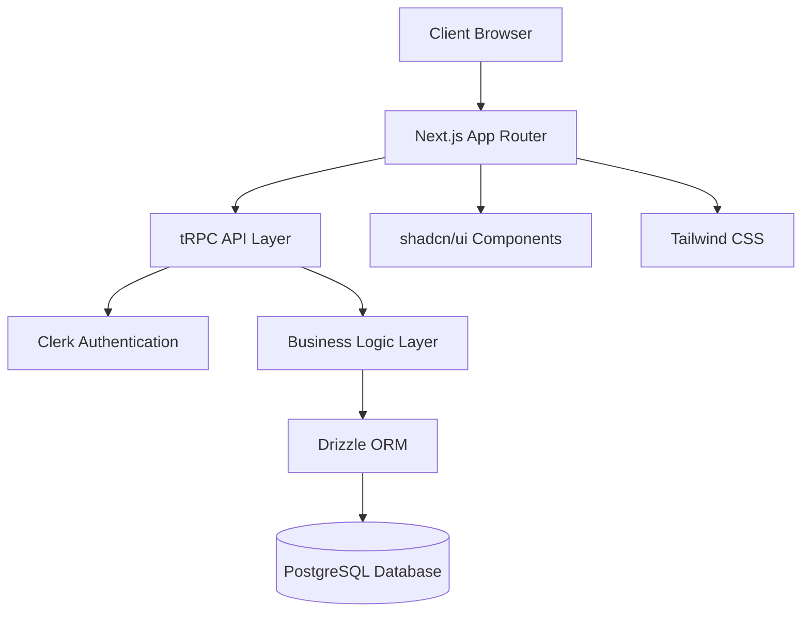
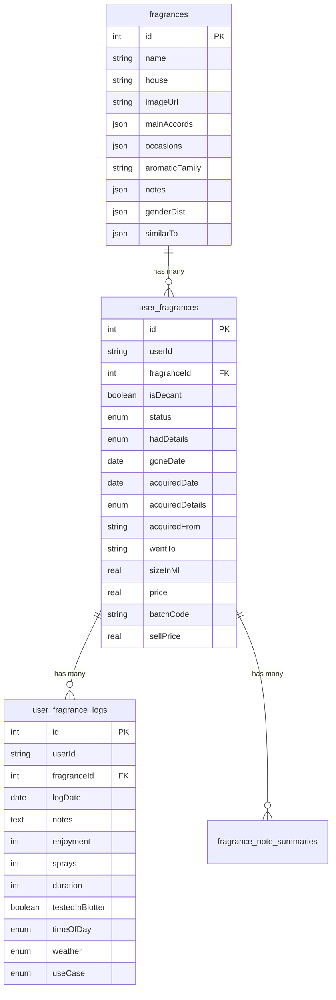

# Design Document

## Overview

The Fragrance Tracking System is built as a modern full-stack web application using Next.js 14 with the T3 Stack architecture. The system follows a layered architecture pattern with clear separation between presentation, business logic, and data persistence layers. The application uses server-side rendering for optimal performance and SEO, while providing rich client-side interactions through React components.

## Architecture

### High-Level Architecture



### Technology Stack

- **Frontend**: Next.js 14 with App Router, React 18, TypeScript
- **Styling**: Tailwind CSS with shadcn/ui component library
- **Backend**: tRPC for type-safe API layer
- **Database**: PostgreSQL with Drizzle ORM
- **Authentication**: Clerk for user management
- **State Management**: TanStack Query (React Query) via tRPC
- **Form Handling**: React Hook Form with Zod validation
- **Charts**: Recharts for data visualization

### Deployment Architecture

- **Hosting**: Vercel (Next.js optimized)
- **Database**: PostgreSQL (cloud-hosted)
- **CDN**: Vercel Edge Network for static assets
- **Authentication**: Clerk cloud service

## Components and Interfaces

### Core Domain Models

#### Fragrance Entity
```typescript
interface Fragrance {
  id: number;
  name: string;
  house: string;
  imageUrl: string;
  mainAccords?: string[];
  occasions?: string[];
  aromaticFamily?: string;
  notes?: {
    top?: string[];
    middle?: string[];
    base?: string[];
  };
  genderDist?: {
    male: number;
    female: number;
    unisex: number;
  };
  similarTo?: string[];
}
```

#### User Fragrance Entity
```typescript
interface UserFragrance {
  id: number;
  userId: string;
  fragranceId: number;
  isDecant: boolean;
  status: 'have' | 'had';
  hadDetails?: 'emptied' | 'sold' | 'gifted' | 'lost' | 'exchanged';
  goneDate?: Date;
  acquiredDate?: Date;
  acquiredDetails: 'bought' | 'gifted' | 'exchanged' | 'giveaway' | 'split' | 'purchaseGift';
  acquiredFrom?: string;
  wentTo?: string;
  sizeInMl: number;
  price: number;
  batchCode?: string;
  sellPrice?: number;
}
```

#### Fragrance Log Entity
```typescript
interface UserFragranceLog {
  id: number;
  userId: string;
  fragranceId: number;
  logDate: Date;
  notes?: string;
  enjoyment?: number; // 1-10 scale
  sprays?: number;
  duration?: number; // in hours
  testedInBlotter: boolean;
  timeOfDay?: 'day' | 'night';
  weather?: 'hot' | 'cold' | 'mild';
  useCase?: 'casual' | 'formal' | 'date' | 'clubbing' | 'concert' | 'sport' | 'hangout' | 'personal' | 'testing' | 'guess_game' | 'nature/outdoors';
}
```

### API Layer Design

#### tRPC Router Structure
```typescript
// Main router composition
export const appRouter = createTRPCRouter({
  fragrances: fragrancesRouter,           // Fragrance master data
  userFragrances: userFragrancesRouter,   // User collection management
  userFragranceLogs: userFragranceLogsRouter, // Usage logging
  userFragranceStats: userFragranceStatsRouter, // Analytics
});
```

#### Key API Endpoints

**Fragrances Router**
- `create`: Add new fragrance to master database
- `search`: Search fragrances by name/house
- `getById`: Retrieve fragrance details

**User Fragrances Router**
- `getAll`: Retrieve user's collection with sorting
- `getLogOptions`: Get fragrances available for logging
- `create`: Add fragrance to user collection
- `update`: Modify collection item details
- `farewell`: Mark fragrance as gone/sold

**User Fragrance Logs Router**
- `getAllUserFragranceLogs`: Retrieve all user logs
- `create`: Create new usage log
- `update`: Modify existing log
- `delete`: Remove log entry

**User Fragrance Stats Router**
- `getFragranceStats`: Individual fragrance analytics
- `getUserOverview`: Overall usage statistics

### Frontend Component Architecture

#### Page Components
```
src/app/
├── page.tsx                    # Home dashboard
├── fragrances/
│   ├── collection/page.tsx     # Collection view
│   ├── add/page.tsx           # Add fragrance
│   └── [fragranceId]/
│       ├── page.tsx           # Fragrance details
│       └── farewell/page.tsx  # Farewell process
├── logs/page.tsx              # Usage logs
└── stats/[fragranceId]/page.tsx # Fragrance statistics
```

#### Reusable Components
- **FragranceCard**: Collection item display
- **NewLogModal**: Usage logging interface
- **LogGroup**: Date-grouped log display
- **Form Components**: Reusable input components
- **Navigation**: App-wide navigation

#### State Management Pattern
- **Server State**: Managed by tRPC + TanStack Query
- **Form State**: React Hook Form with Zod validation
- **UI State**: React useState for component-level state
- **Global State**: Minimal, primarily authentication via Clerk

## Data Models

### Database Schema Design

#### Core Tables
1. **fragrances**: Master fragrance database
2. **user_fragrances**: User collection items
3. **user_fragrance_logs**: Usage tracking
4. **fragrance_note_summaries**: AI-generated summaries

#### Relationships


#### Data Validation
- **Zod Schemas**: Type-safe validation for all inputs
- **Database Constraints**: Referential integrity and data validation
- **Business Rules**: Enforced at API layer

### Data Access Patterns

#### Repository Pattern Implementation
- **Drizzle ORM**: Type-safe database queries
- **Query Optimization**: Efficient joins and indexing
- **Transaction Management**: Atomic operations for complex updates

## Error Handling

### Error Handling Strategy

#### Client-Side Error Handling
```typescript
// tRPC error handling with user-friendly messages
const { mutate, error, isLoading } = api.userFragrances.create.useMutation({
  onError: (error) => {
    if (error.data?.code === 'CONFLICT') {
      toast.error('This fragrance is already in your collection');
    } else {
      toast.error('Failed to add fragrance. Please try again.');
    }
  }
});
```

#### Server-Side Error Handling
```typescript
// tRPC procedure with proper error handling
export const createUserFragrance = privateProcedure
  .input(createUserFragranceSchema)
  .mutation(async ({ ctx, input }) => {
    try {
      return await ctx.db.insert(userFragrances).values({
        ...input,
        userId: ctx.currentUserId,
      });
    } catch (error) {
      if (error.code === '23505') { // Unique constraint violation
        throw new TRPCError({
          code: 'CONFLICT',
          message: 'Fragrance already exists in collection',
        });
      }
      throw new TRPCError({
        code: 'INTERNAL_SERVER_ERROR',
        message: 'Failed to add fragrance',
      });
    }
  });
```

#### Error Categories
1. **Validation Errors**: Input validation failures
2. **Authentication Errors**: Unauthorized access attempts
3. **Business Logic Errors**: Rule violations
4. **Database Errors**: Constraint violations, connection issues
5. **External Service Errors**: Clerk authentication failures

#### Error Recovery Strategies
- **Retry Logic**: Automatic retry for transient failures
- **Fallback UI**: Graceful degradation for missing data
- **User Feedback**: Clear error messages and recovery actions
- **Logging**: Comprehensive error tracking for debugging

## Testing Strategy

### Testing Pyramid

#### Unit Tests
- **Component Testing**: React Testing Library for UI components
- **API Testing**: tRPC procedure testing with mock database
- **Utility Testing**: Pure function testing for helpers
- **Validation Testing**: Zod schema validation testing

#### Integration Tests
- **API Integration**: End-to-end tRPC router testing
- **Database Integration**: Drizzle ORM query testing
- **Authentication Integration**: Clerk integration testing

#### End-to-End Tests
- **User Flows**: Critical path testing with Playwright
- **Cross-Browser**: Multi-browser compatibility testing
- **Mobile Testing**: Responsive design validation

### Testing Tools and Frameworks
- **Jest**: Unit test runner
- **React Testing Library**: Component testing
- **Playwright**: E2E testing
- **MSW**: API mocking for tests
- **Test Database**: Isolated test environment

### Testing Patterns
- **Arrange-Act-Assert**: Standard test structure
- **Test Data Builders**: Consistent test data creation
- **Page Object Model**: E2E test organization
- **Snapshot Testing**: UI regression prevention

### Performance Testing
- **Load Testing**: API endpoint performance
- **Bundle Analysis**: JavaScript bundle optimization
- **Core Web Vitals**: User experience metrics
- **Database Performance**: Query optimization validation

## Security Considerations

### Authentication and Authorization
- **Clerk Integration**: Secure user authentication
- **JWT Tokens**: Stateless session management
- **Route Protection**: Server-side route guards
- **API Security**: User-scoped data access

### Data Protection
- **Input Sanitization**: XSS prevention
- **SQL Injection Prevention**: Parameterized queries via Drizzle
- **CSRF Protection**: Next.js built-in protection
- **Data Encryption**: Sensitive data encryption at rest

### Privacy and Compliance
- **User Data Isolation**: Strict user data separation
- **Data Retention**: Configurable data retention policies
- **Audit Logging**: User action tracking
- **GDPR Compliance**: Data export and deletion capabilities